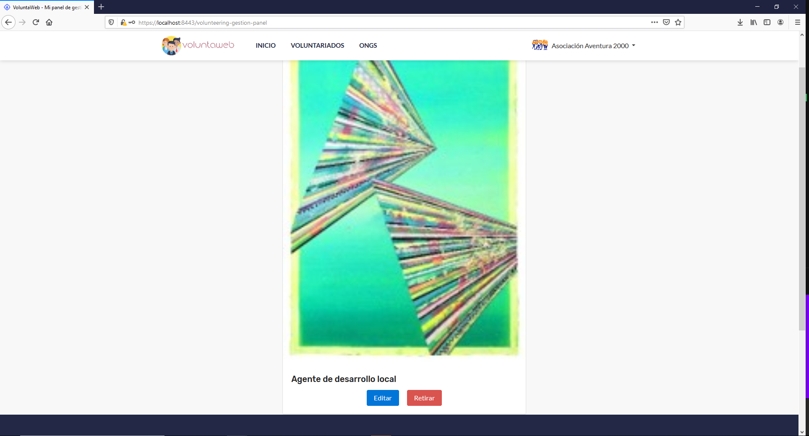
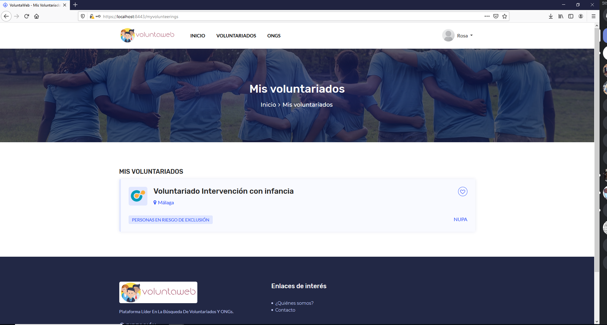
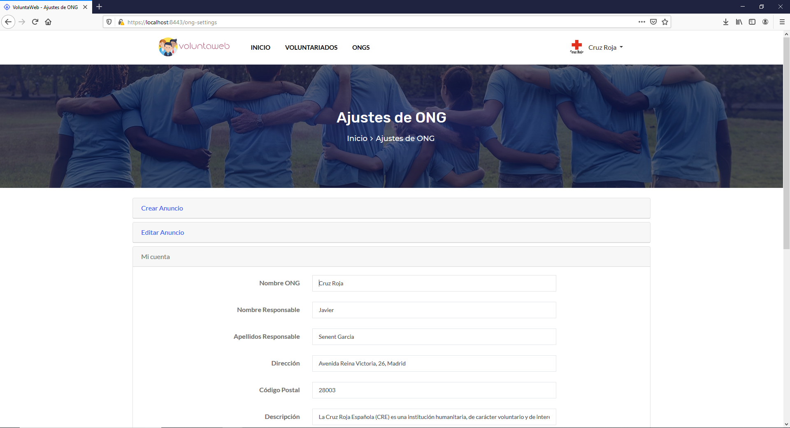
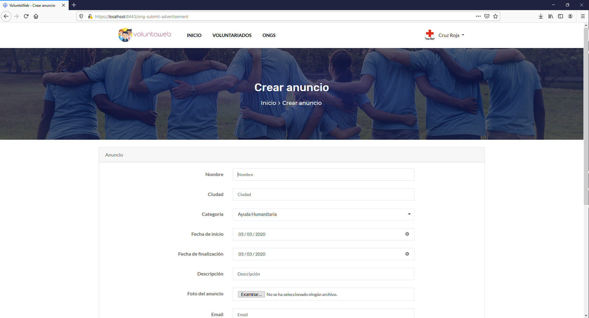
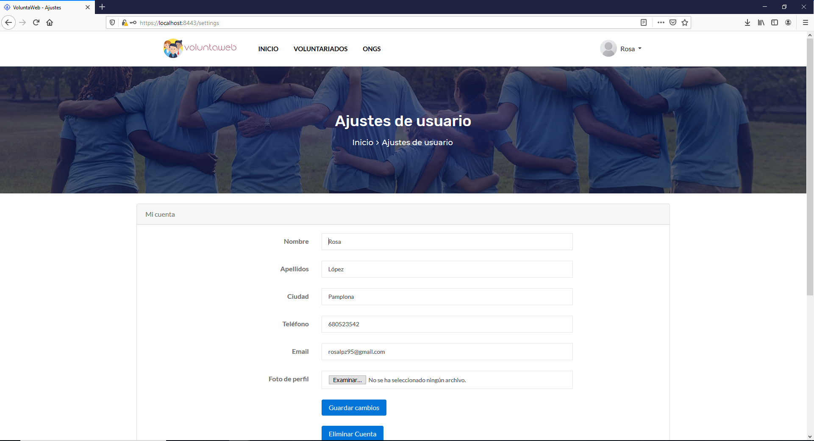
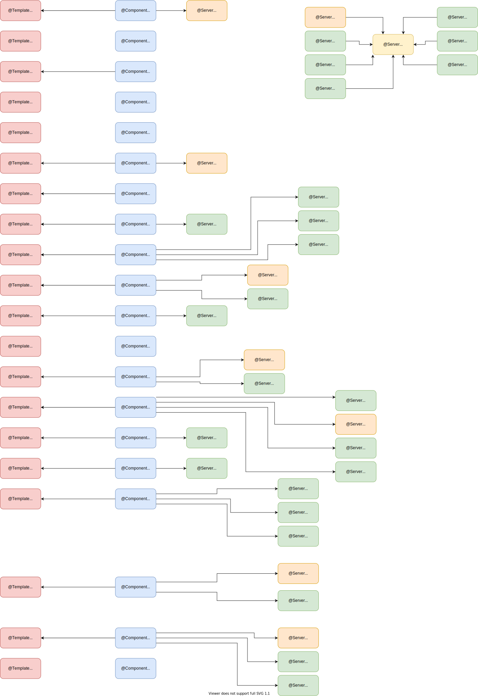

# VoluntaWeb - Group 7 
VoluntaWeb is a project developed by group 7 of the subject "Web Application Development". It consists of an online site where you can publish your volunteer ad or search for NGOs to join them. You will have a panel from where you can manage your ads (if you register as an NGO) or consult which NGOs you are helping.

## Members
| Name | Mail address | GitHub username|
|--------|--------|------------|
|Alicia Merino Martínez| a.merinom.2017@alumnos.urjc.es| aliholi44 |
|Daniel Fuente Martínez| d.fuente.2017@alumnos.urjc.es | dfuente2017 |
|Daniel Serrano Cobos| d.serranoc.2017@alumnos.urjc.es | theroxd4n |
|Pablo Atahonero García de Blas| p.atahonero.2017@alumnos.urjc.es | PabloAtahoneroGB |
|Samuel Severiche Berna | s.severiche.2017@alumnos.urjc.es | sbsam |

  
## Our links
[Trello](https://trello.com/b/nNVdsRsp)
[Youtube]() 

## Main aspects
### Entities
VoluntaWeb has 4 entities: users (users table), support comments (comments table), NGOs(ngos table) and volunteerings (volunteerings table).  
-NGOs can publish volunteerings ads (ngo_volunteering table).  
-Users can join volunteerings (user_volunteering).  
### Permissions
-Visitors can search NGOs and volunteerings but not join them or like them.  
-Logged users can do the actions vistors can do, but also join volunteerings and like them and modify their user settings.  
-NGOs can publish volunteerings and edit/remove them, aswell edit their NGO settings.  
-Administrator can moderate volunteerings.  
### Images
-Logged user have a profile image.  
-NGOs have a profile image.  
-Volunteerings have a banner image.  
### Charts
We're implemented graphic charts:  
-Volunteerings published in a month.  
-Users joined for a volunteering in a month.  
-Users registered in a month.  
### Complementary technonlogies
-We are consuming the Google Maps API for include location map in a volunteering.
### Advanced algorithm
-The search page has a search filter for volunteerings and NGOs.
### Phase 2
#### Navigation diagram

#### Database diagram
 

#### Class diagram
 

### Screenshots

#### Description
"Index" page is the main page of the web application. It's the entry point to the other pages.

#### Description
"About Us" is a page that have some information about VoluntaWeb and it's objectives.  

#### Description
The "Contact" page, as her name says, is for contact the administrator of the website in order to make sugerences and questions.  

#### Description
"Volunteering-gestion-panel" is a page that have, mainly, two options: edit and delete. Also appears the last modification.

#### Description
"Ongs" is a page that contains all ONGs that are in our data base. It is possible to filter a search looking ONG's name.

#### Description
"Login" is a page where users, such as volunteers and ONGs, can login and browse the website.

#### Description
This webpage shows all the volunteers to whom a user of the web has subscribed, with their title, their location, the email of the corresponding NGO and more information about the activity by clicking on it.
 

#### Description
This webpage shows information about a specific NGO, with its name, its data and also a short description. Also below shows recent volunteers from that NGO.

#### Description
This website allows NGOs to change data on their Voluntaweb account such as their name, address, email, category, profile picture etc.
  

#### Description
This webpage allows users to chose if they want register as NGOs or Volunteers.

#### Description
This webpage allows NGOs to create an account in VoluntaWeb.

#### Description
This webpage allows Volunteers to create an account in VoluntaWeb.

#### Description
“Searches” This page display the results of a search and allow the user to change the parameters of the search.

#### Description
“Ong submit advertisement” This page will allow the NGOs to submit a volunteering offer.

#### Description
“User settings” This page will allow the user to change the settings of his account.

#### Description
 “Volunteering” This page is an example of the design of the volunteering offers.

## Development environment setup:
For the development of this application we have used Spring in its latest version. Specifically, we have used the Spring Tools 4 development. This tool is available for different IDEs (Eclipse, visual studio code, Theia).
* Install Java SE Development Kit 13
* Install Eclipse IDE
* Install Sprint Tools 4 from the Eclipse Marketplace.
* Import the project: File> Import> Maven> Existing Maven Projects> Browse directory > Select folder of the project and finish.

## Commits list 
| Member | 5 relevant commits |
| ------------- | ------------- |
| Samuel | 1. [ONG and ONG detail pages](https://github.com/CodeURJC-DAW-2019-20/webapp7/commit/d03b6925d0180e26073c256db742148e9630ca52)  2. [Register ong with images](https://github.com/CodeURJC-DAW-2019-20/webapp7/commit/9dc0e565dc08f194a5fb35668cc43c18049379f9)  3. [User and ONG settings](https://github.com/CodeURJC-DAW-2019-20/webapp7/commit/096279ec03e3b45181bf7cf30eff13238b3ad365)  4. [Admin pages and minor fixes (admin pages: ngos, volunteerings, users, comments and delete functionality)](https://github.com/CodeURJC-DAW-2019-20/webapp7/commit/68c4c9f041207f7693c6de17da0f071b596d4f1c)  5. [admin comments section and aboutus navbar](https://github.com/CodeURJC-DAW-2019-20/webapp7/commit/0b04bed303adcda43580a4189fe8d4205f7abbc4)
| Alicia Merino | 1. [Volunteering's View](https://github.com/CodeURJC-DAW-2019-20/webapp7/commit/645c8c4ed416fc3ad7adcdf7f717d4bc3ff165d8)  2. [Join button](https://github.com/CodeURJC-DAW-2019-20/webapp7/commit/bd4371dafed99d1d00701c9d9616fca13c7acc64)  3. [deleteCount and delete an account](https://github.com/CodeURJC-DAW-2019-20/webapp7/commit/db5bd38de804813d0e016b84129d07dec338c7ee)  4. [fixed some pages](https://github.com/CodeURJC-DAW-2019-20/webapp7/commit/896e6d77e04293f2478c1beb34cf3685d499134c)  5. [aboutUs page](https://github.com/CodeURJC-DAW-2019-20/webapp7/commit/cbf9fd1af161a578851e299316cc33a1d159f52b)
| Pablo Atahonero| 1. [Like any volunteering](https://github.com/CodeURJC-DAW-2019-20/webapp7/commit/4ce8a55ea9e4b14da6e2c33d2861688bad108eeb)  2. [Delete a like from a volunteering](https://github.com/CodeURJC-DAW-2019-20/webapp7/commit/4ce8a55ea9e4b14da6e2c33d2861688bad108eeb)  3. [Knowing if i liked a volunteering by the style of like button](https://github.com/CodeURJC-DAW-2019-20/webapp7/commit/4ce8a55ea9e4b14da6e2c33d2861688bad108eeb)  4. [Number of likes in total of the volunteerings](https://github.com/CodeURJC-DAW-2019-20/webapp7/commit/4ce8a55ea9e4b14da6e2c33d2861688bad108eeb)  5. [Page my volunteerings](https://github.com/CodeURJC-DAW-2019-20/webapp7/commit/76362269727bb112cff14df6f5cfd16f3418bef7)
| Daniel Fuente  | 1. [Creación, edición y borrado de anuncios y edición de ong funcionando](https://github.com/CodeURJC-DAW-2019-20/webapp7/commit/33a3d94cd3ca9662ee2e71835ef7b4c3d179ae6c)  2. [Implementado subida de imágenes y consumo en la lista de voluntariado…](https://github.com/CodeURJC-DAW-2019-20/webapp7/commit/e82f5e1c1b204327b342771d2f9916c18d7b738c)  3. [Rama lista para implementar el usuario.](https://github.com/CodeURJC-DAW-2019-20/webapp7/commit/fa0b71e60828bce18d3294e81b0b0970e18dae90)  4. [Cambiado category a como esta en develop.](https://github.com/CodeURJC-DAW-2019-20/webapp7/commit/f95f745c45ac44a289edae1ca883fc0cb551a4e6)  5. [Actualizados navbar de la parte de ongs](https://github.com/CodeURJC-DAW-2019-20/webapp7/commit/fb34ded98c95e401dd7adf6373c892f4b697fd76)
| Daniel Serrano | 1. [The Great Commit](https://github.com/CodeURJC-DAW-2019-20/webapp7/commit/3e19774a18789f96d0c22ce31b3a3d4f7b8ad89d)  2. [Merge pull request #5 from CodeURJC-DAW-2019-20/feature/charts](https://github.com/CodeURJC-DAW-2019-20/webapp7/commit/099c943f340b0c15f5e7fea96c526e725c31a919)  3. [Merge pull request #4 from CodeURJC-DAW-2019-20/feature/search](https://github.com/CodeURJC-DAW-2019-20/webapp7/commit/6473753ca43fac44c5df06df7935bb919624ce2c)  4. [Merge pull request #17 from CodeURJC-DAW-2019-20/feature/comments](https://github.com/CodeURJC-DAW-2019-20/webapp7/commit/49a82bdbaecf6782659d0f0ad24e11db15ff601c)  5. [login bug](https://github.com/CodeURJC-DAW-2019-20/webapp7/commit/03dd7f6b6d526e9549ee44a650b73ca0d7741835)

### Phase 3
## Class diagram

## API documentation
Document [Api documentation](API.md) with information about the REST API.

## Dockerized application execution instructions
Document [Execution instructions](./backend/docker-compose.yml) with information about execution instructions using docker-compose.yml.

## Development Environment Preparation
Document [Development Environment](./backend/Dockerfile) with information about development environment configuration.

## Commits list

| Member | 5 relevant commits | 5 relevant files |
| ------------- | ------------- | ------------- |
| Samuel  | 1. [Page request](https://github.com/CodeURJC-DAW-2019-20/webapp7/commit/8e2bd0e1ea30a1d23bf24eacd73799e1b2f8c868)  2. [Image download for ongRestController](https://github.com/CodeURJC-DAW-2019-20/webapp7/commit/8f964609ca91c860119a1a792b32bfb514818d45)  3. [Admin and search rest controller](https://github.com/CodeURJC-DAW-2019-20/webapp7/commit/9e1f12668c0061108a6636ea64a6edfaed11ab41) | 1. SearchRestController.java  2. VolunteeringService.java  3. ONGRestController.java |
| Alicia Merino | 1. [Get Volunteering and Create a Volunteering](https://github.com/CodeURJC-DAW-2019-20/webapp7/commit/e8dd99fca3240433a4b02e167f66f07a56561912)  2. [Added some methods to VolunteeringRestController](https://github.com/CodeURJC-DAW-2019-20/webapp7/commit/fc7323482fd90c7c2ed030a1cdd347a315ebbb2b)  3. [fixed some errors](https://github.com/CodeURJC-DAW-2019-20/webapp7/commit/0bd7183109ee985b8d37442a928c2c8a07cc5ecd)  4. [like volunteering](https://github.com/CodeURJC-DAW-2019-20/webapp7/commit/6c463f2da3f9e20a234a4d12d90e13b884af9a92)  5. [Created and done most methods in API.md](https://github.com/CodeURJC-DAW-2019-20/webapp7/commit/7e327c2a5afde7c3cedb2a78b79618e1cc5be9c6) | 1. VolunteeringRestController.java   2. Category.java   3. VolunteeringRepository.java  4. API.md  5. UserService.java|
| Pablo Atahonero  | 1. [Create comments developed](aea5c7a3fa9e0475924947aae00e219b92f252f1)  2. [Get the list of all the comments](aea5c7a3fa9e0475924947aae00e219b92f252f1)  3. [Get a comment by his id](aea5c7a3fa9e0475924947aae00e219b92f252f1)  4. [Delete a comment by his Id](aea5c7a3fa9e0475924947aae00e219b92f252f1)  5. [Fixed errors whit url](bc68c348700b7524a1ae9fd4c718db8b4c8c068b) | 1. CommentRestController.java  2. CommentRepository.java  3. CommentService.java  4. comments rows in database  5. READ.ME|
| Daniel Fuente  | 1. [Added images on UserRestController and changed their URLs](https://github.com/CodeURJC-DAW-2019-20/webapp7/commit/331311a49663cc36099cebb29ca6dae9d18c941c)  2. [Implemeted images with VolunteeringRestController](https://github.com/CodeURJC-DAW-2019-20/webapp7/commit/01adfa086288de034d3335abf99dd0682075bb40)  3. [Added images to volunteerings and ngos](https://github.com/CodeURJC-DAW-2019-20/webapp7/commit/d25d811fa769dd98cbee934f4241e4f298524911)  4. [Added Postman file](https://github.com/CodeURJC-DAW-2019-20/webapp7/commit/a058088f81dd5e0e4f181323c4194505dbd654a5)  5. [Added images with rest controller](https://github.com/CodeURJC-DAW-2019-20/webapp7/commit/574d0fa98972a5ab8529c90f2efaf90e9a9c07c1)   | 1. api.postman_collection.json  2. ONGRestController.java  3. UserRestController.java  4. ImageService  5.  VolunteeringRestController.java|
| Daniel Serrano  | 1. [Merge pull request #21 from CodeURJC-DAW-2019-20/feature/LoginAPI](https://github.com/CodeURJC-DAW-2019-20/webapp7/commit/0fefbd04f941177febf829ff7eb323504841325b)  2. [user and ong login](https://github.com/CodeURJC-DAW-2019-20/webapp7/commit/8c952ff6814503376e7ff9eee8736344a3a48d58)  3. [Permissions in Volunteering methods](https://github.com/CodeURJC-DAW-2019-20/webapp7/commit/c293d86bca57217985f114ac8c8233fce1478538)  4. [Permissions in UserRestController methods](https://github.com/CodeURJC-DAW-2019-20/webapp7/commit/c7d1f5b21bfb5c81a9d7f1d71a812f1093f11f4f)  5. [Permissions in ONGRestController](https://github.com/CodeURJC-DAW-2019-20/webapp7/commit/6e7f19b3a5b2d7ab5a790875f55173b0d4bc9528)  | 1. LoginRestController.java  2. RestSecurityConfiguration.java  3. UserRestController.java  4. VolunteeringRestController.java  5.  OngRestController.java|

### Phase 4
## Development Environment Preparation

## Class diagram

## Commits list

| Member | 5 relevant commits | 5 relevant files |
| ------------- | ------------- | ------------- |
| Samuel Severiche | 1.   2.   3.   4.   5.  | 1.   2.   3.   4.   5.  |
| Alicia Merino | 1.   2.   3.   4.   5.  | 1.   2.   3.   4.   5.  |
| Pablo Atahonero  | 1.   2.   3.   4.   5.  | 1.   2.   3.   4.   5.  |
| Daniel Fuente  | 1.   2.   3.   4.   5.  | 1.   2.   3.   4.   5.  |
| Daniel Serrano  | 1.   2.   3.   4.   5.  | 1.   2.   3.   4.   5.  |

