

# VoluntaWeb - Group 7 
VoluntaWeb is a project developed by group 7 of the subject "Web Application Development". It consists of an online site where you can publish your volunteer ad or search for NGOs to join them. You will have a panel from where you can manage your ads (if you register as an NGO) or consult which NGOs you are helping.

## Members
| Name | Mail address | GitHub username|
|--------|--------|------------|
|Alicia Merino Martínez| a.merinom.2017@alumnos.urjc.es| aliholi44 |
|Daniel Fuente Martínez| d.fuente.2017@alumnos.urjc.es | dfuente2017 |
|Daniel Serrano Cobos| d.serranoc.2017@alumnos.urjc.es | theroxd4n |
|Pablo Atahonero García de Blas| p.atahonero.2017@alumnos.urjc.es | PabloAtahoneroGB |
|Samuel Severiche Berna | s.severiche.2017@alumnos.urjc.es | sbsam |

  
## Our links
[Trello](https://trello.com/b/nNVdsRsp)

## Main aspects
### Entities
VoluntaWeb has 4 entities: users (users table), support comments (comments table), NGOs(ngos table) and volunteerings (volunteerings table).  
-NGOs can publish volunteerings ads (ngo_volunteering table).  
-Users can join volunteerings (user_volunteering).  
### Permissions
-Visitors can search NGOs and volunteerings but not join them or like them.  
-Logged users can do the actions vistors can do, but also join volunteerings and like them and modify their user settings.  
-NGOs can publish volunteerings and edit/remove them, aswell edit their NGO settings.  
-Administrator can moderate volunteerings.  
### Images
-Logged user have a profile image.  
-NGOs have a profile image.  
-Volunteerings have a banner image.  
### Charts
We're implemented graphic charts:  
-Volunteerings published in a month.  
-Users joined for a volunteering in a month.  
-Users registered in a month.  
### Complementary technonlogies
-We are consuming the Google Maps API for include location map in a volunteering.
### Advanced algorithm
-The search page has a search filter for volunteerings and NGOs.
### Diagrams
#### Navigation diagram

#### Database diagram
 

#### Class diagram
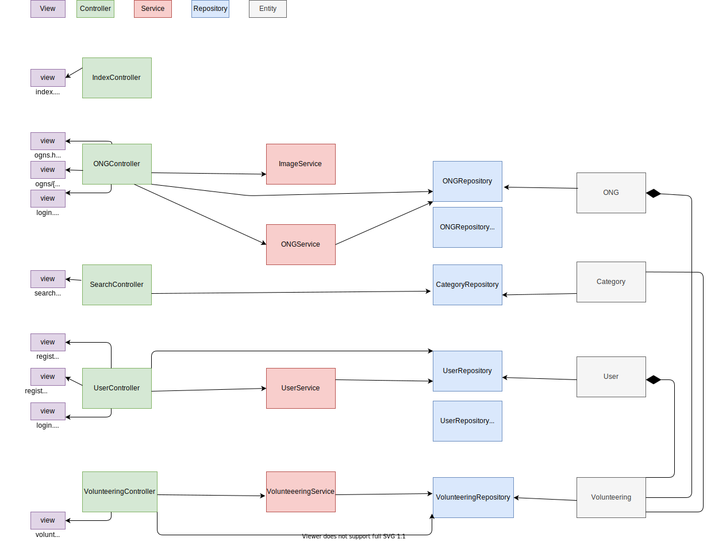 

### Screenshots
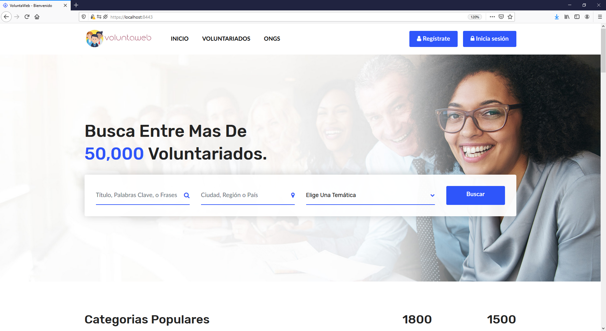
#### Description
"Index" page is the main page of the web application. It's the entry point to the other pages.

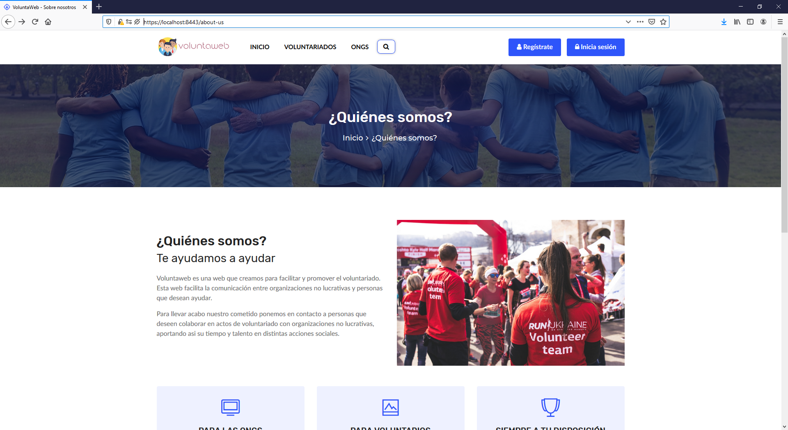
#### Description
"About Us" is a page that have some information about VoluntaWeb and it's objectives.  

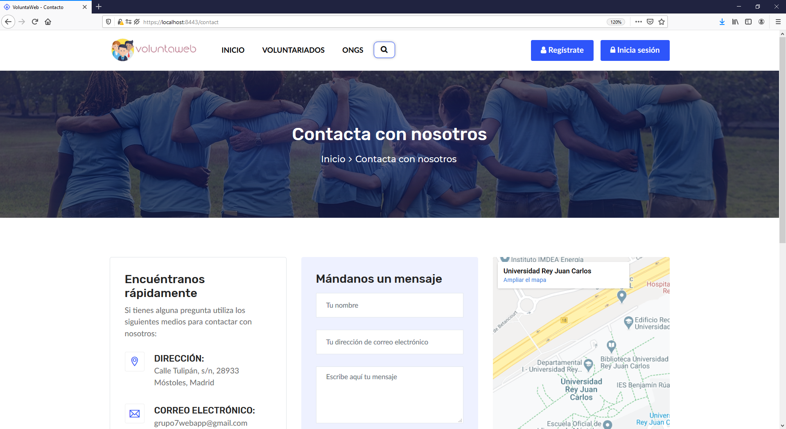
#### Description
The "Contact" page, as her name says, is for contact the administrator of the website in order to make sugerences and questions.  

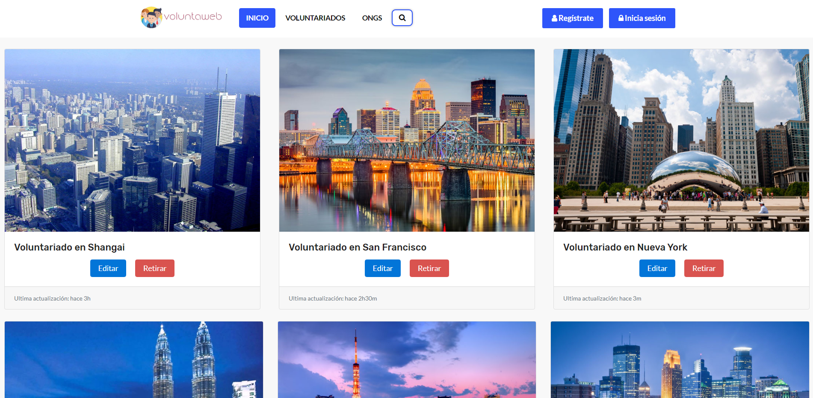
#### Description
"Volunteering-gestion-panel" is a page that have, mainly, two options: edit and delete. Also appears the last modification.

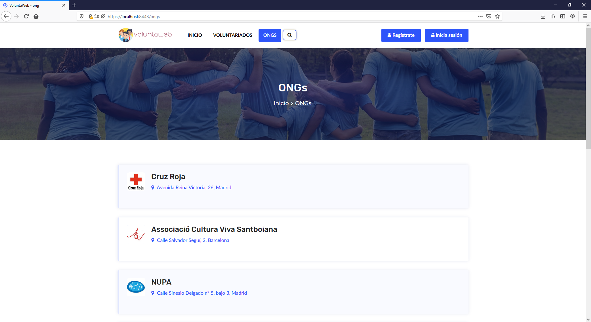
#### Description
"Ongs" is a page that contains all ONGs that are in our data base. It is possible to filter a search looking ONG's name.

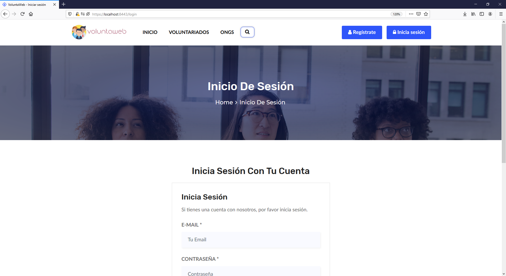
#### Description
"Login" is a page where users, such as volunteers and ONGs, can login and browse the website.

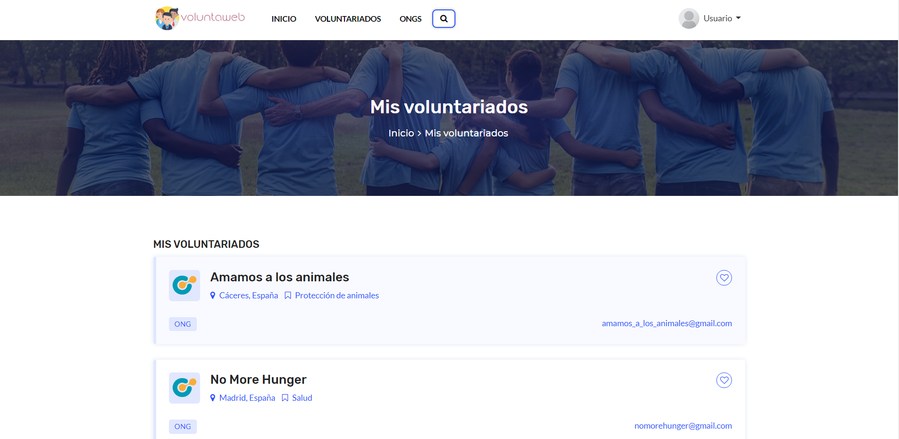
#### Description
This webpage shows all the volunteers to whom a user of the web has subscribed, with their title, their location, the email of the corresponding NGO and more information about the activity by clicking on it.
 
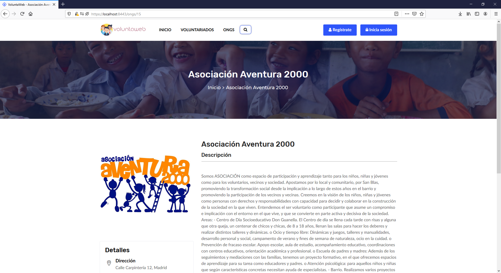
#### Description
This webpage shows information about a specific NGO, with its name, its data and also a short description. Also below shows recent volunteers from that NGO.

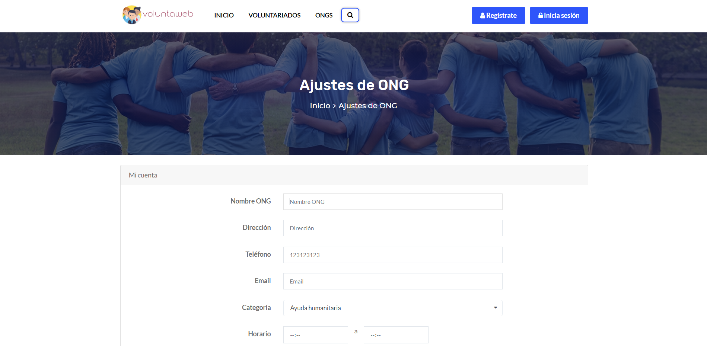
#### Description
This website allows NGOs to change data on their Voluntaweb account such as their name, address, email, category, profile picture etc.
  
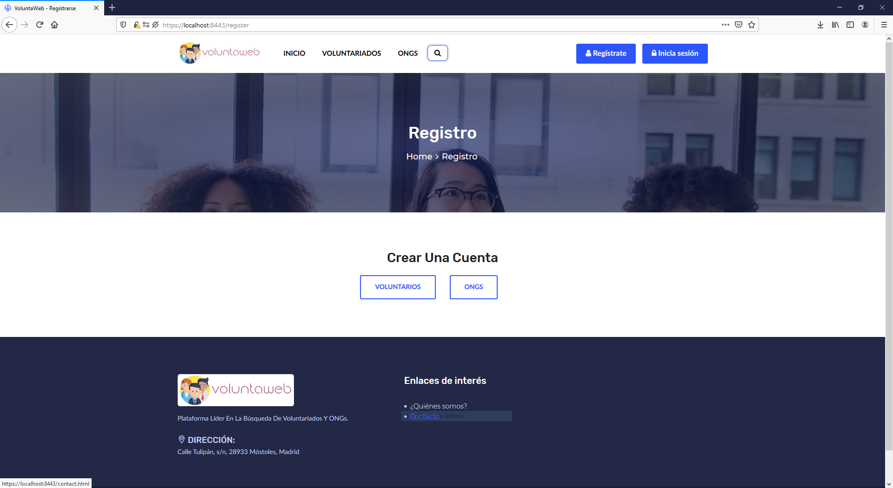
#### Description
This webpage allows users to chose if they want register as NGOs or Volunteers.

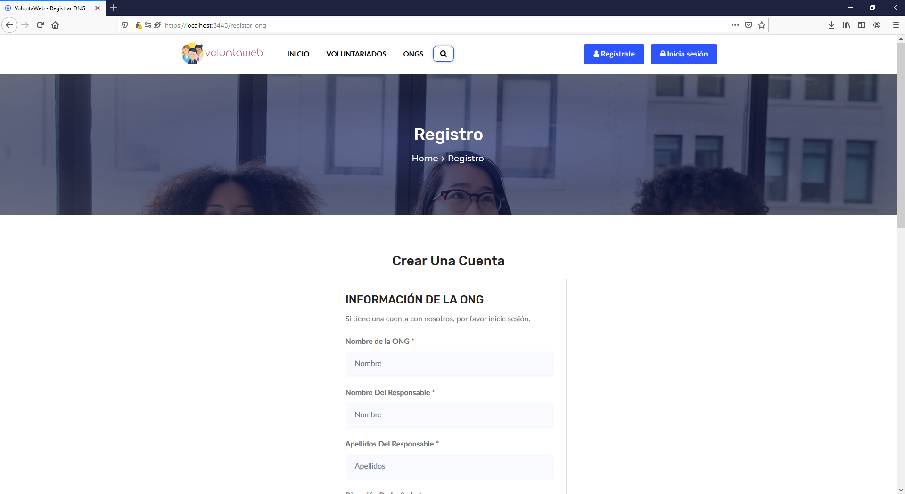
#### Description
This webpage allows NGOs to create an account in VoluntaWeb.

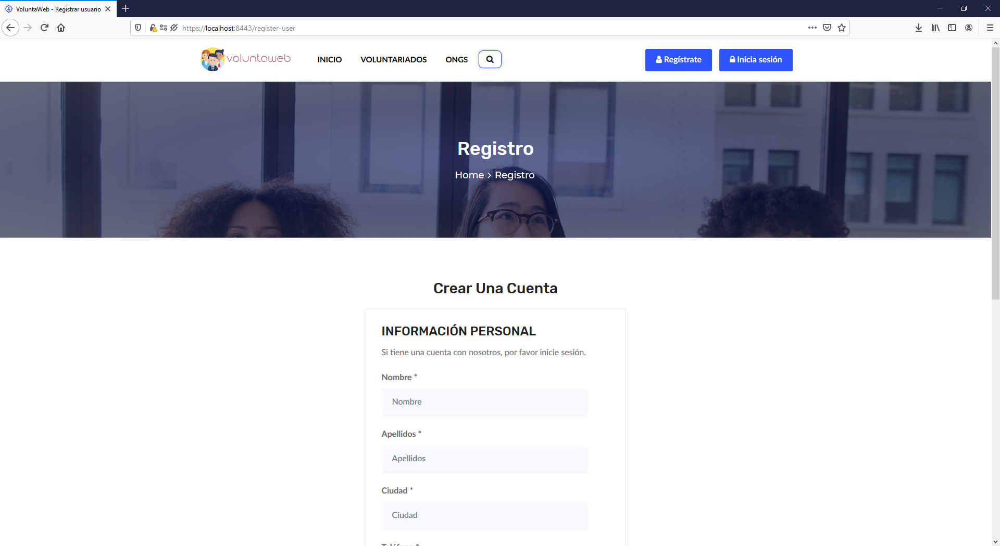
#### Description
This webpage allows Volunteers to create an account in VoluntaWeb.

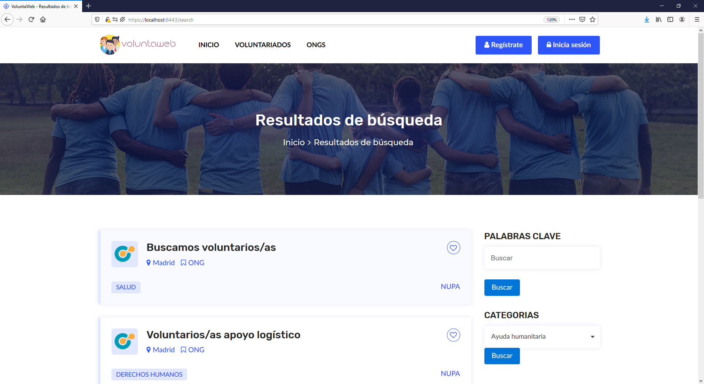
#### Description
“Searches” This page display the results of a search and allow the user to change the parameters of the search.

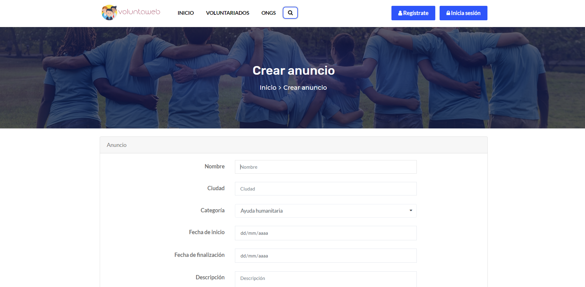
#### Description
“Ong submit advertisement” This page will allow the NGOs to submit a volunteering offer.

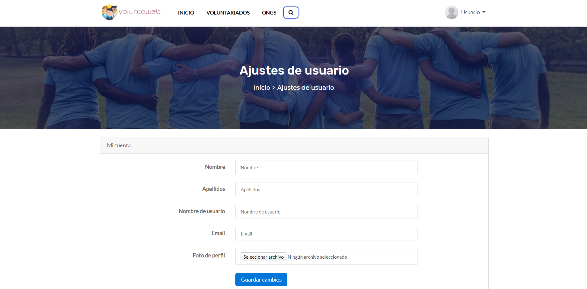
#### Description
“User settings” This page will allow the user to change the settings of his account.

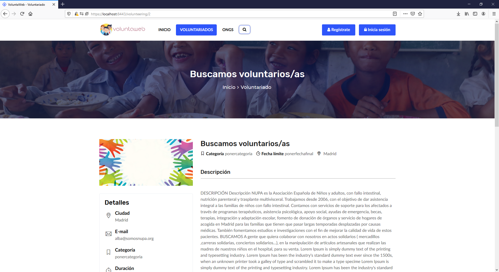
#### Description
 “Volunteering” This page is an example of the design of the volunteering offers.

## Development environment setup:
For the development of this application we have used Spring in its latest version. Specifically, we have used the Spring Tools 4 development. This tool is available for different IDEs (Eclipse, visual studio code, Theia).
* Install Java SE Development Kit 13
* Instal Eclipse IDE
* Install Sprint Tools 4 from the Eclipse Marketplace.
* Import the project: File> Import> Maven> Existing Maven Projects> Browse directory > Select folder of the project and finish.

## Commits list
