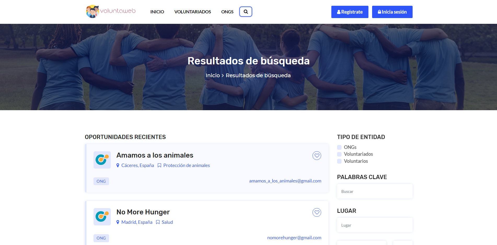

# VoluntaWeb - Group 7 
VoluntaWeb is a project developed by group 7 of the subject "Web Application Development". It consists of an online site where you can publish your volunteer ad or search for NGOs to join them. You will have a panel from where you can manage your ads (if you register as an NGO) or consult which NGOs you are helping.

## Members
| Name | Mail address | GitHub username|
|--------|--------|------------|
|Alicia Merino Martínez| a.merinom.2017@alumnos.urjc.es| aliholi44 |
|Daniel Fuente Martínez| d.fuente.2017@alumnos.urjc.es | dfuente2017 |
|Daniel Serrano Cobos| d.serranoc.2017@alumnos.urjc.es | theroxd4n |
|Pablo Atahonero García de Blas| p.atahonero.2017@alumnos.urjc.es | PabloAtahoneroGB |
|Samuel Severiche Berna | s.severiche.2017@alumnos.urjc.es | sbsam |

  
## Our links
[Trello](https://trello.com/b/nNVdsRsp)

## Main aspects
### Entities
VoluntaWeb has 4 entities: users (users table), support comments (comments table), NGOs(ngos table) and volunteerings (volunteerings table).
-NGOs can publish volunteerings ads (ngo_volunteering table).
-Users can join volunteerings (user_volunteering).
### Permissions
-Visitors can search NGOs and volunteerings but not join them or like them.
-Logged users can do the actions vistors can do, but also join volunteerings and like them and modify their user settings.
-NGOs can publish volunteerings and edit/remove them, aswell edit their NGO settings.
-Administrator can moderate volunteerings.
### Images
-Logged user have a profile image.  
-NGOs have a profile image.  
-Volunteerings have a banner image.  
### Charts
We're implemented graphic charts:  
-Volunteerings published in a month.  
-Users joined for a volunteering in a month.  
-Users registered in a month.  
### Complementary technonlogies
-We are consuming the Google Maps API for include location map in a volunteering.
### Advanced algorithm
-The search page has a search filter for volunteerings and NGOs.
### Diagrams
  

### Screenshots

