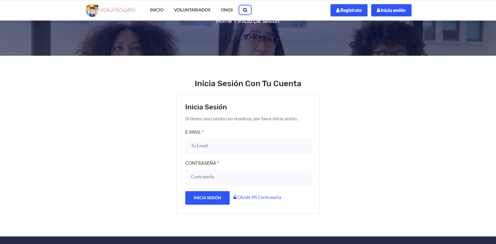

# VoluntaWeb - Group 7 
VoluntaWeb is a project developed by group 7 of the subject "Web Application Development". It consists of an online site where you can publish your volunteer ad or search for NGOs to join them. You will have a panel from where you can manage your ads (if you register as an NGO) or consult which NGOs you are helping.

## Members
| Name | Mail address | GitHub username|
|--------|--------|------------|
|Alicia Merino Martínez| a.merinom.2017@alumnos.urjc.es| aliholi44 |
|Daniel Fuente Martínez| d.fuente.2017@alumnos.urjc.es | dfuente2017 |
|Daniel Serrano Cobos| d.serranoc.2017@alumnos.urjc.es | theroxd4n |
|Pablo Atahonero García de Blas| p.atahonero.2017@alumnos.urjc.es | PabloAtahoneroGB |
|Samuel Severiche Berna | s.severiche.2017@alumnos.urjc.es | sbsam |

  
## Our links
[Trello](https://trello.com/b/nNVdsRsp)

## Main aspects
### Entities
VoluntaWeb has 4 entities: users (users table), support comments (comments table), NGOs(ngos table) and volunteerings (volunteerings table).  
-NGOs can publish volunteerings ads (ngo_volunteering table).  
-Users can join volunteerings (user_volunteering).  
### Permissions
-Visitors can search NGOs and volunteerings but not join them or like them.  
-Logged users can do the actions vistors can do, but also join volunteerings and like them and modify their user settings.  
-NGOs can publish volunteerings and edit/remove them, aswell edit their NGO settings.  
-Administrator can moderate volunteerings.  
### Images
-Logged user have a profile image.  
-NGOs have a profile image.  
-Volunteerings have a banner image.  
### Charts
We're implemented graphic charts:  
-Volunteerings published in a month.  
-Users joined for a volunteering in a month.  
-Users registered in a month.  
### Complementary technonlogies
-We are consuming the Google Maps API for include location map in a volunteering.
### Advanced algorithm
-The search page has a search filter for volunteerings and NGOs.
### Diagrams
  

### Screenshots

"Index" page is the main page of the web application. It's the entry point to the other pages.

"About Us" is a page that have some information about VoluntaWeb and it's objectives.  

The "Contact" page, as her name says, is for contact the administrator of the website in order to make sugerences and questions.  

Esta página solamente estará disponible para las ONGs y servirá para gestionar los voluntariados de su organización. Para ello, se muestran todos los voluntariados y en cada uno de ellos tenemos la opción de editar con el botón "Editar" y de borrar con el botón "Borrar". Además, se puede visualizar el tiempo que ha pasado desde su última modificación.

En esta página se podrán buscar todas las ONGs filtrando por la primera letra del nombre de la organización. En cada logo se podrá acceder al perfil de la ONG deseada.

 Esta página servirá para iniciar sesión con una cuenta ya creada, tanto para voluntariados como para ONGs. Se introduce el e-mail con su contraseña correspondiente y se inicia sesión; si hay algún percance con el olvido de la contraseña, se enviará un mensaje para restablecerla.

This webpage shows all the volunteers to whom a user of the web has subscribed, with their title, their location, the email of the corresponding NGO and more information about the activity by clicking on it.
 

This webpage shows information about a specific NGO, with its name, its data and also a short description. Also below shows recent volunteers from that NGO.

This website allows NGOs to change data on their Voluntaweb account such as their name, address, email, category, profile picture etc.
  

  

  

 

